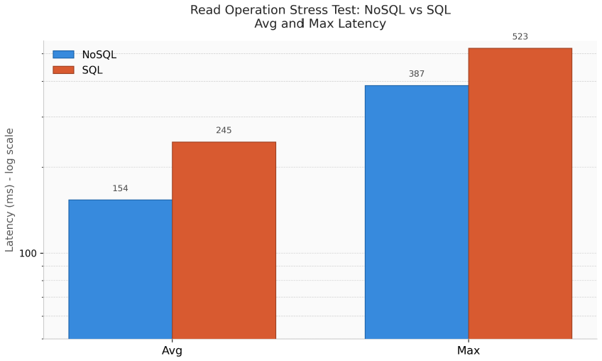
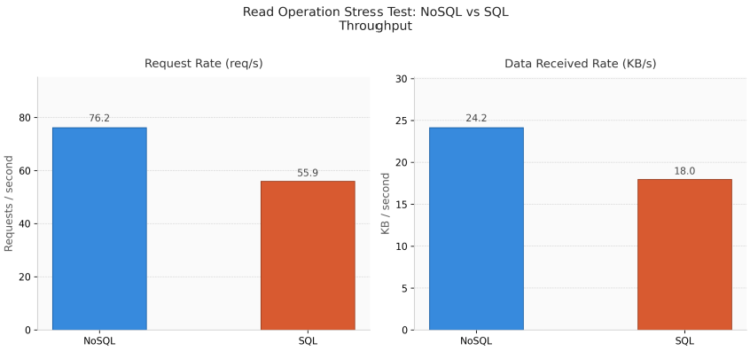

## Testing Result
### NoSQL

### SQL

#### Metode Eksekusi Terminal (k6 CLI)
Pengujian performa dieksekusi secara langsung melalui *PowerShell terminal* dengan memisahkan *environment variable* global menggunakan perintah `$env:DB_TYPE="neo4j"` untuk NoSQL dan `$env:DB_TYPE="sql"` untuk SQL, kemudian dilanjutkan dengan pemanggilan *binary execution tool* eksternal melalui perintah `& "C:\Program Files\k6\k6.exe" run stress-test.js`. Untuk mendukung visualisasi data, perintah pengujian juga diintegrasikan dengan parameter `--summary-export=nosql-results.json` untuk mengekstraksi seluruh metrik performa secara terstruktur ke dalam dokumen JSON, sebelum akhirnya dipetakan menjadi grafik performa sistem.

#### Visualisasi Grafik
##### 1. Latency Test Result

##### 2. Throughput Test Result

#### Analisis Hasil Pengujian Berdasarkan Grafik
Berdasarkan visualisasi grafik batang yang dihasilkan dari pengujian *stress test*, efisiensi performa sistem menunjukkan perbedaan yang sangat signifikan antara kedua arsitektur database:

1. **Evaluasi Matriks Latency (Waktu Respon):**
   Melalui grafik *Avg and Max Latency*, terbukti bahwa arsitektur NoSQL Graph memiliki performa komputasi yang jauh lebih ringan. Rata-rata waktu respon (*Average Latency*) untuk **NoSQL** hanya **154 ms**, berbanding terbalik dengan **SQL** yang meningkat hingga **245 ms**. Hal yang sama terlihat pada *Maximum Latency*, di mana batas atas lonjakan waktu respon NoSQL mampu diredam pada **387 ms**, sedangkan SQL melonjak hingga **523 ms** akibat tingginya beban kalkulasi pencarian indeks.

2. **Evaluasi Matriks Throughput (Produktivitas Data):**
   Dampak efisiensi latensi tersebut berbanding lurus dengan produktivitas server yang ditunjukkan pada grafik *Throughput*. Pada grafik *Request Rate*, **NoSQL** mampu melayani kecepatan transfer hingga **76.2 req/s** (requests per second), sedangkan **SQL** lebih lambat dengan kecepatan transfer **55.9 req/s**. Unggulnya produktivitas NoSQL ini juga dibuktikan oleh grafik *Data Received Rate*, di mana **NoSQL** mencatat kecepatan penyerapan dan transmisi data yang lebih tinggi sebesar **24.2 KB/s** dibandingkan **SQL** yang hanya mampu menyalurkan data sebesar **18.0 KB/s** dalam kondisi beban yang sama.

